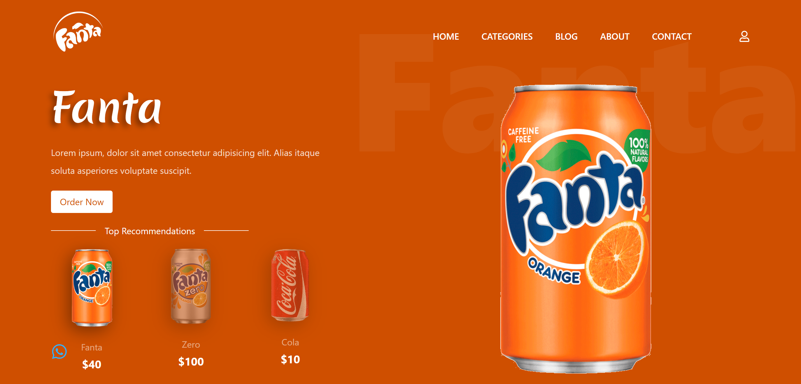
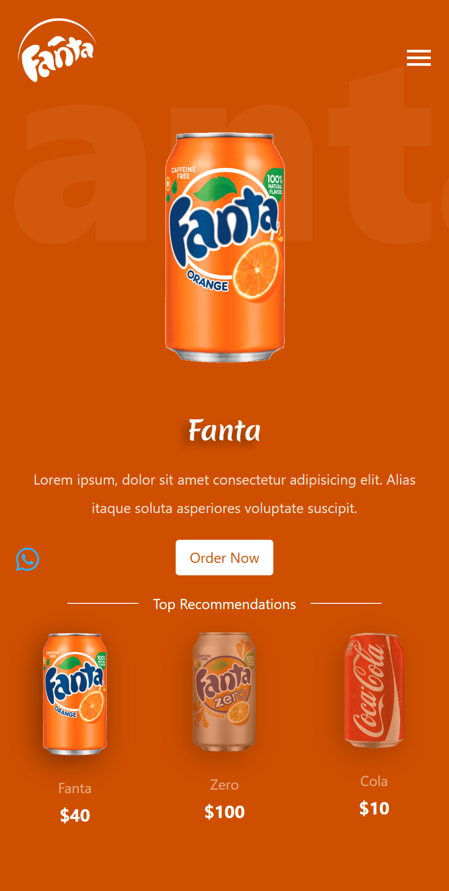

# Fanta Website

A vibrant and engaging landing page for Fanta, designed using React and styled to match the energetic and colorful vibe of the Fanta brand. Smooth animations and interactive visuals give the site a lively user experience.

## 🚀 Features

-  Interactive product slider
-  Bright and colorful Fanta-themed UI
-  Framer Motion for smooth animations
-  Fully responsive for all screen sizes

## 🔧 Tech Stack

- **React**
- **Framer Motion**
- **Tailwind** 
- **Vite** 

## 📸 Screenshots

 ### Desktop view  

  

 ### Mobile view
  
  

## 🛠️ Installation

1. Clone the repo:
   
   git clone https://github.com/your-username/fanta-website.git
   
   cd fanta-website
   
3. Install dependencies:

    npm install

4. Start the dev server:

    npm run dev

